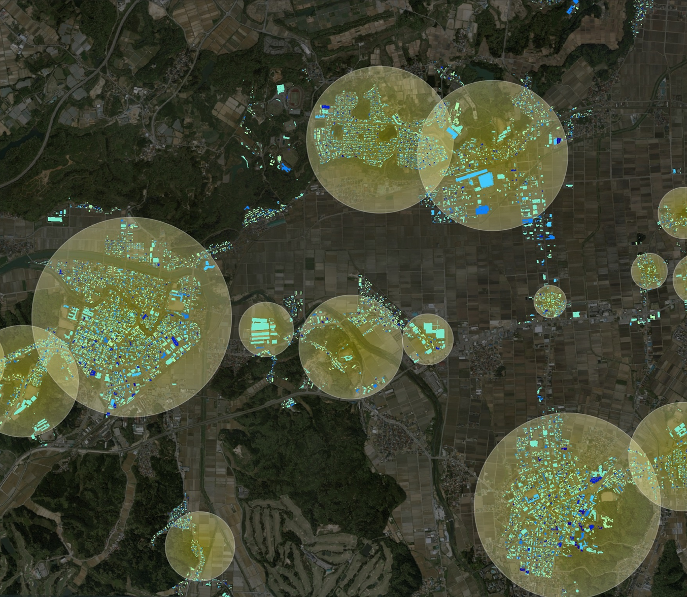

# 建物振動シミュレーションシステム

本リポジトリでは、Bridgeの令和4年度のユースケース開発業務の一部であるuc23-24「建物振動シミュレーションシステム」について、その成果物である「建物振動シミュレーションシステム」のソースコードを公開しています。

「建物振動シミュレーションシステム」は、システムで提供する計算に必要な属性情報を含むProject PLATEAUの建物3Dモデル、および、地震動ファイルを入力パラメータとして、スーパーコンピューターをはじめとする様々な地震動シミュレーターに対し計算を依頼。

その後、得られた計算結果から可視化ファイルを生成。最終的にWebブラウザ上で、指定した地域にて、指定した地震動ファイルの大規模地震が起きた際の被害状況を可視化することによって、大きな被害が予測されるエリアの特定するなど、都道府県・市町村の事前の防災検討に活用できることを目指したシステムです。

