# 操作マニュアル

# 1 本書について

本書では、建物振動シミュレーションシステム（以下「本システム」という。）の操作手順について記載しています。

# 2 使い方

## 2-1 ログイン画面

本システムにアクセスすると、まずログイン画面が表示されます。

Emailアドレスとパスワードを入力し、「ログイン」ボタンを押下すると、メニュー画面が表示されます。

## 2-2 メニュー画面

広域のシミュレーションを行うか、個別建物のシミュレーションを行うかを選択します。

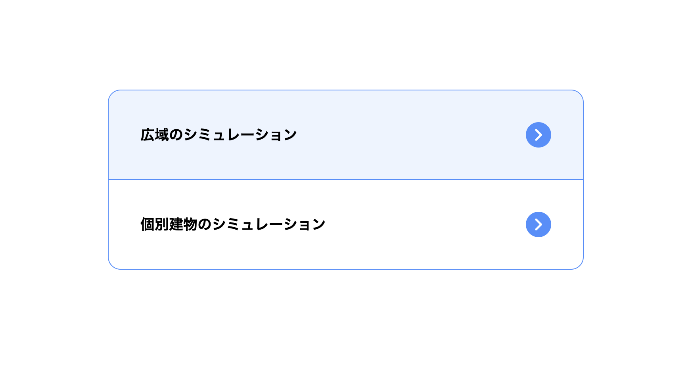

## 2-2-1 広域のシミュレーションメニュー画面

1. 対象地域メッシュプリセット
  シミュレーションの対象地域のプリセットを登録する機能です。

2. 地震動データプリセット
  シミュレーションに使用する地震動データのプリセットを登録する機能です。

3. シミュレーション予約登録
  シミュレーションの予約を登録する機能です。

4. シミュレーション管理
  シミュレーションの管理を行う機能です。

5. メニューに戻る
  メニュー画面に戻ります。

## 2-2-1-1 地域プリセット一覧

登録されている地域プリセットの一覧が表示されます。

1. 地域プリセットの新規登録
  地域プリセットの新規登録画面に遷移します。

2. 地域プリセットの付帯情報の登録
  既存の地域プリセットに付帯情報を登録します。

3. 地域プリセットの削除
  選択した地域プリセットを削除します。

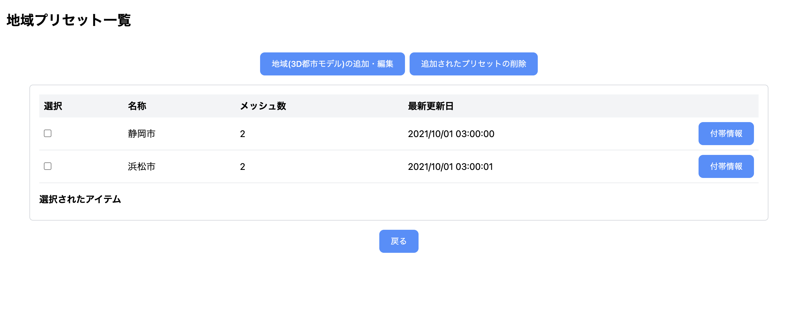

## 2-2-1-2 地域プリセット新規登録

1. 地域名
  地域プリセットの名前を入力します。

2. 地域メッシュ
  地域プリセットの対象地域のメッシュを選択します。
  地図画面に遷移し、該当地域を選択します。

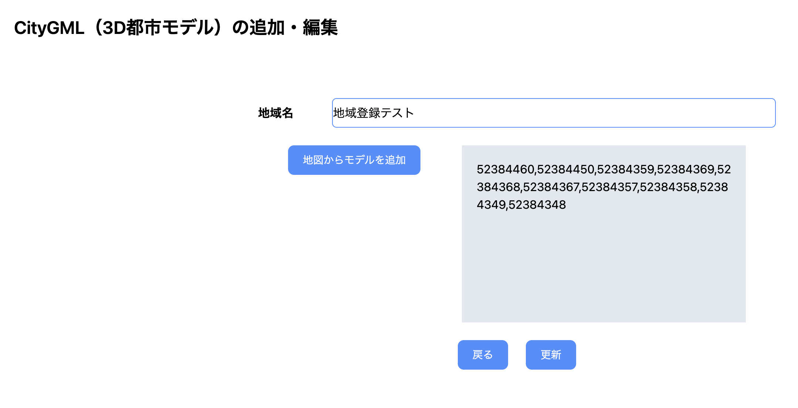

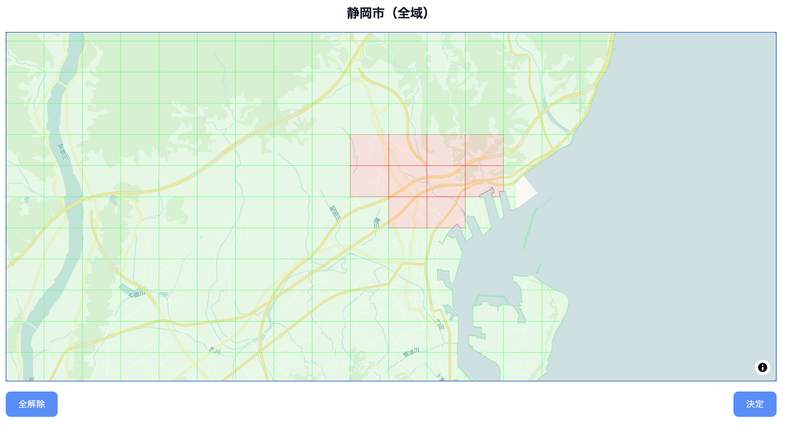

## 2-2-1-3 シミュレーション予約

地域と地震動データを選択し、シミュレーションの予約を登録します。

## 2-2-1-4 シミュレーション管理

1. 登録されているシミュレーションの一覧が表示されます

2. ステータスの欄に、現在の状況が表示されます

3. シミュレーションの詳細を確認するには、詳細ボタンを押下します

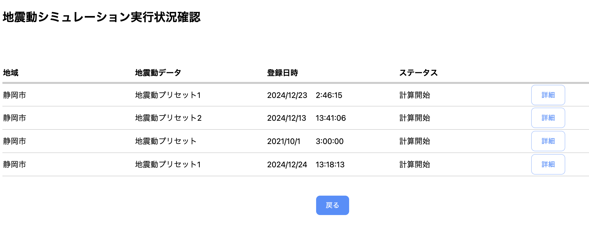

## 2-2-1-5 シミュレーション予約詳細

シミュレーションの詳細を確認します。

データのダウンロード、およびデータ可視化の結果に遷移することができます。

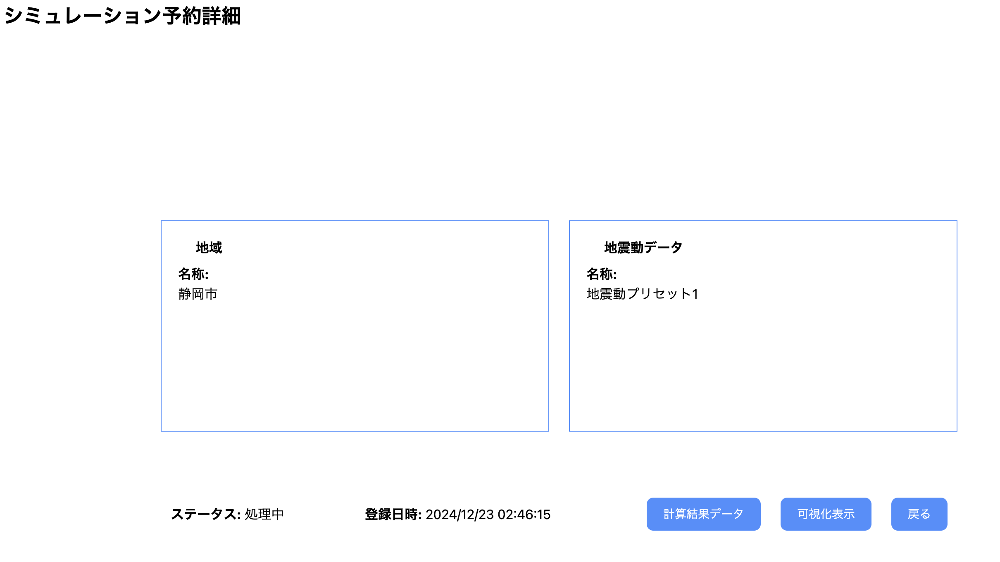

## 2-2-2 個別建物のシミュレーションメニュー画面

1. 建物データプリセット
  シミュレーションの対象建物のプリセットを登録する機能です。

2. 解析モデルプリセット
  シミュレーションに使用する解析モデルデータのプリセットを登録する機能です。

3. シミュレーション予約登録
  シミュレーションの予約を登録する機能です。

4. シミュレーション管理
  シミュレーションの管理を行う機能です。

5. メニューに戻る
  メニュー画面に戻ります。

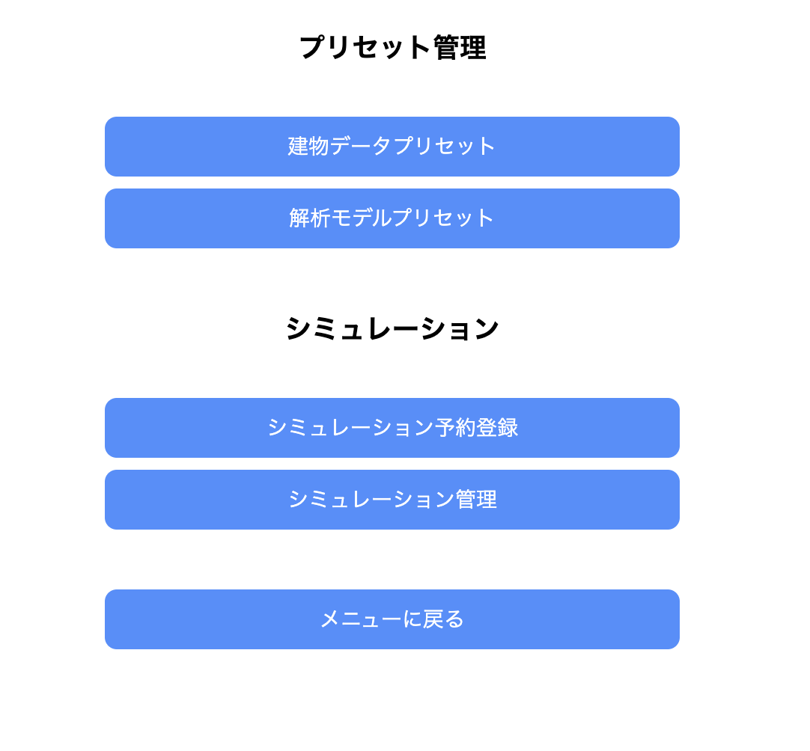

# 2-2-2-1 建物データプリセット一覧

登録されている建物データプリセットの一覧が表示されます。

1. 建物データプリセットの新規登録
  建物データプリセットの新規登録画面に遷移します。

2. 建物データプリセットの付帯情報の登録
  既存の建物データプリセットに付帯情報を登録します。

3. 建物データプリセットの削除
  選択した建物データプリセットを削除します。

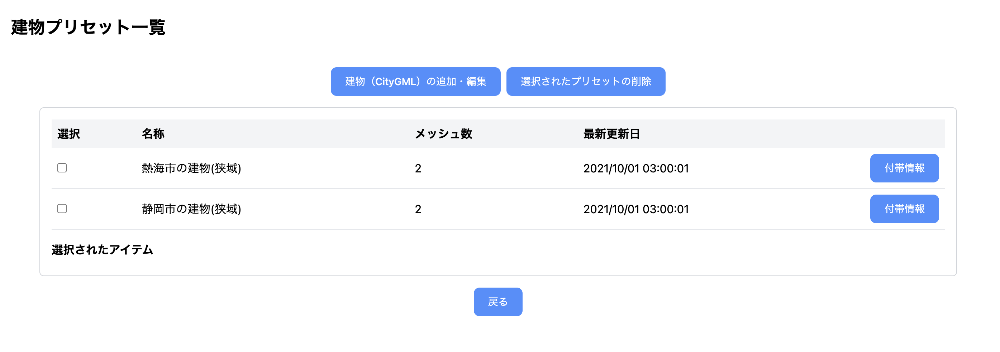

## 2-2-2-2 建物データプリセット新規登録

1. 建物名
  建物データプリセットの名前を入力します。

2. 緯度
  建物の緯度を入力します。

3. 経度
  建物の経度を入力します。

緯度と経度は、地図画面に遷移し、該当地域を選択できます。

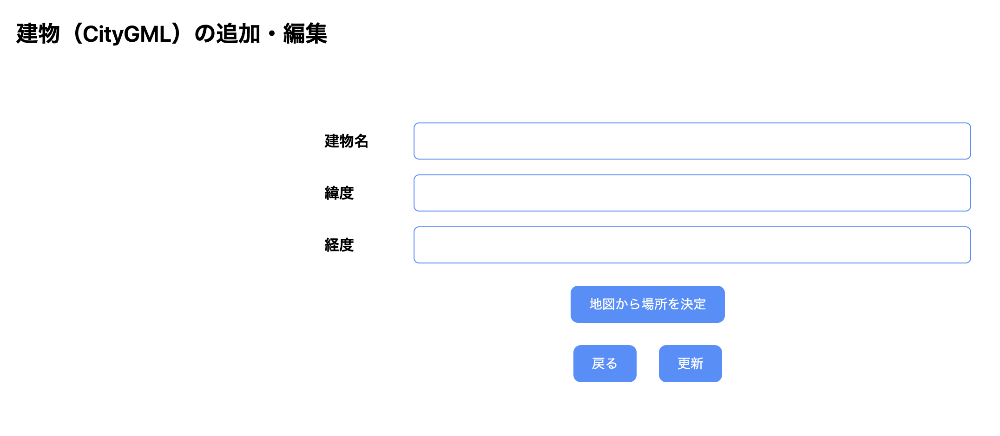

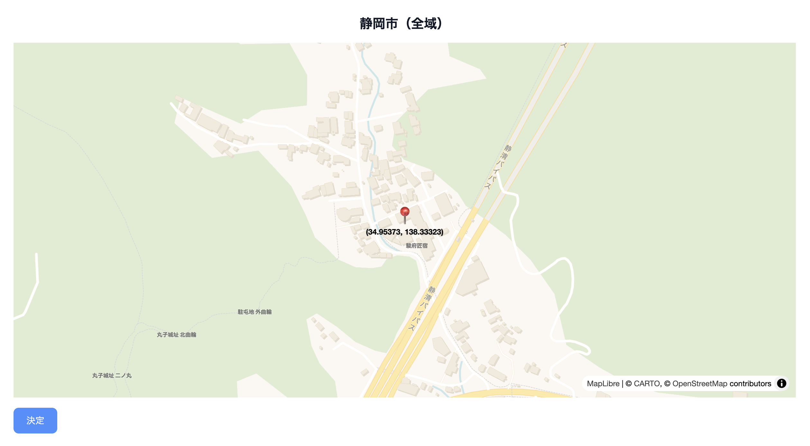

## 2-2-2-3 シミュレーション予約

建物と解析モデルを選択し、シミュレーションの予約を登録します。

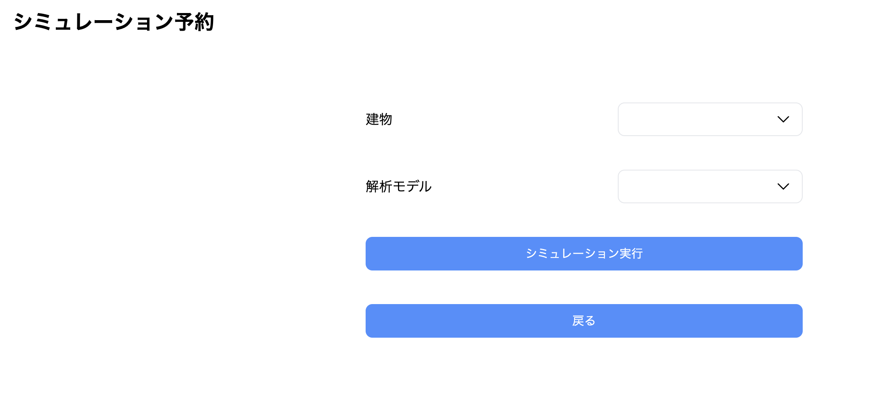

## 2-2-2-4 シミュレーション管理

1. 登録されているシミュレーションの一覧が表示されます

2. ステータスの欄に、現在の状況が表示されます

3. シミュレーションの詳細を確認するには、詳細ボタンを押下します

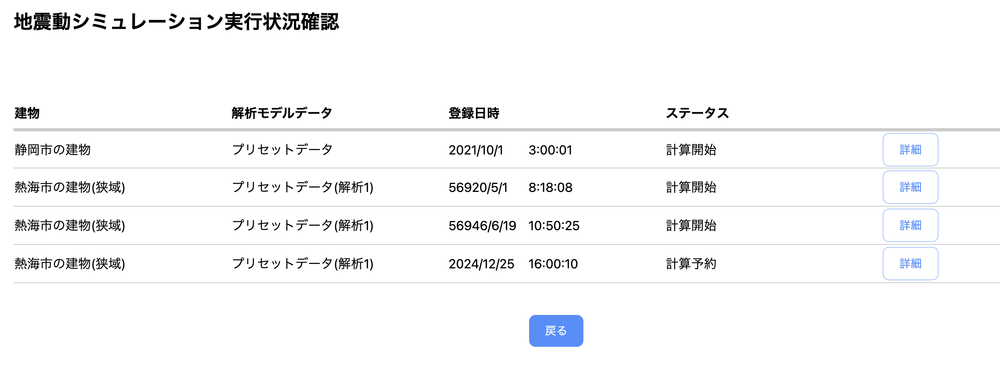

## 2-2-2-5 シミュレーション予約詳細

シミュレーションの詳細を確認します。

データのダウンロード、およびデータ可視化の結果に遷移することができます。

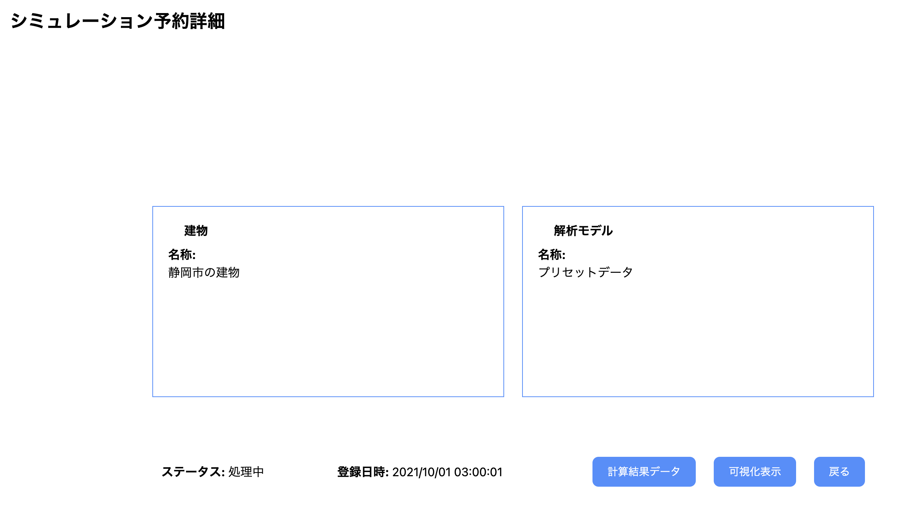

## 2-3 シミュレーション結果
## 2-3-1 広域シミュレーション結果

地震動における建物の倒壊危険性が色分けされて表示されます。

## 2-3-2 時系列データの表示

地震の際、建物がどれだけ揺れるのかを時系列で表示します。

再生コントロールが表示されます。

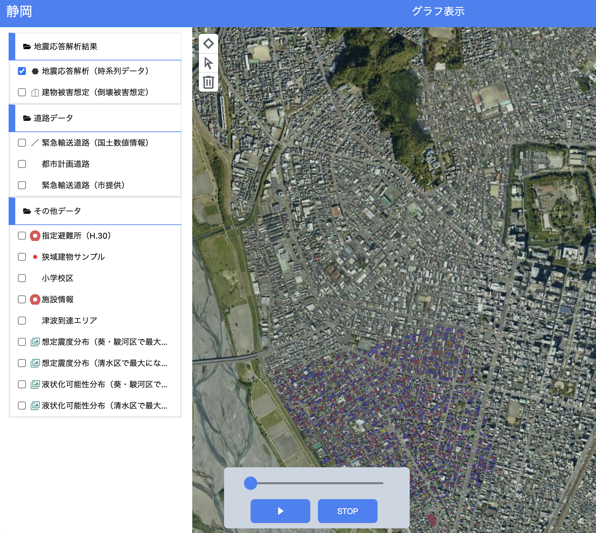

## 2-3-3 緊急輸送道路のバッファ表示

緊急輸送道路のバッファが表示されます。

バッファの大きさは画面から変更可能です。

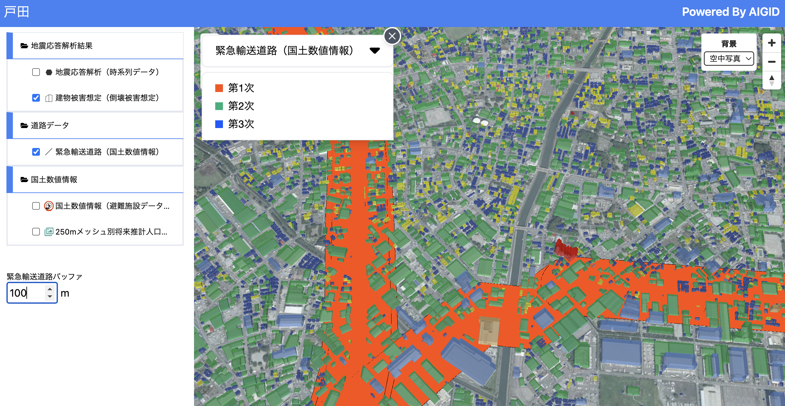

## 2-3-4 シミュレーション結果比較ダッシュボード

地図上の任意の範囲を選択し、結果をグラフで表示します。

最大2箇所の選択が可能です。

選択する毎に、前のグラフが置き換わって表示されます。

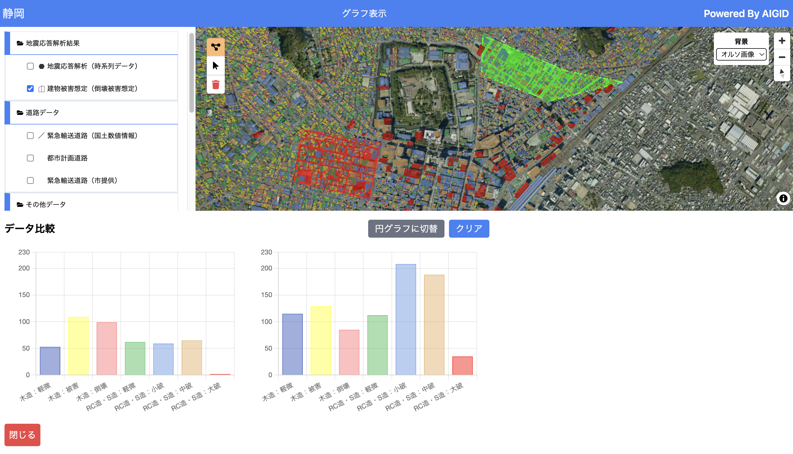

## 2-3-5 個別建物シミュレーション結果

戸別建物のシミュレーション結果が表示されます。

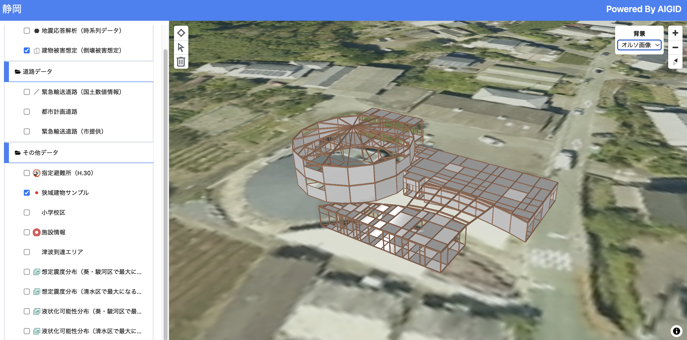

