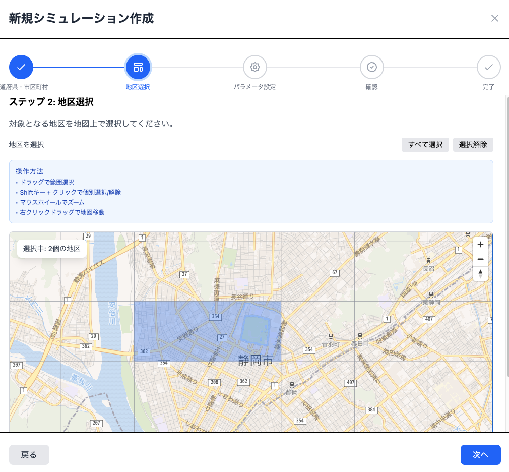
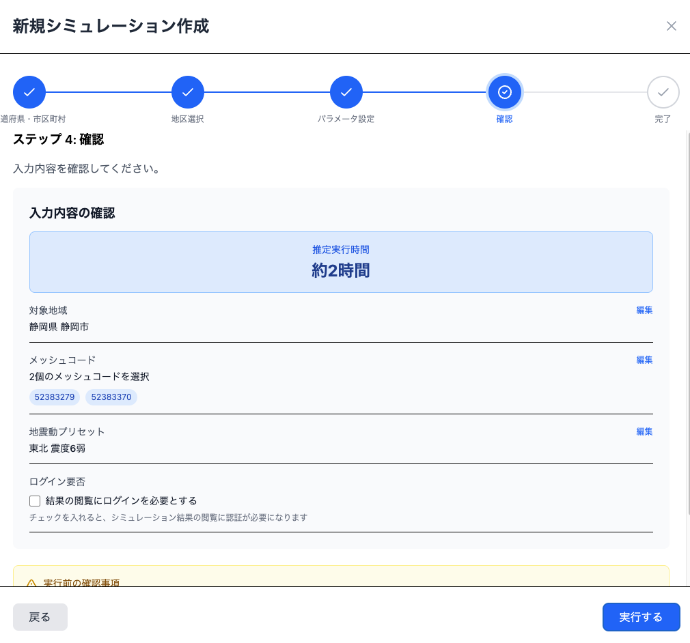
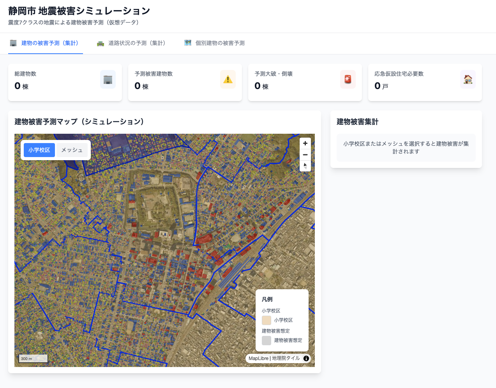
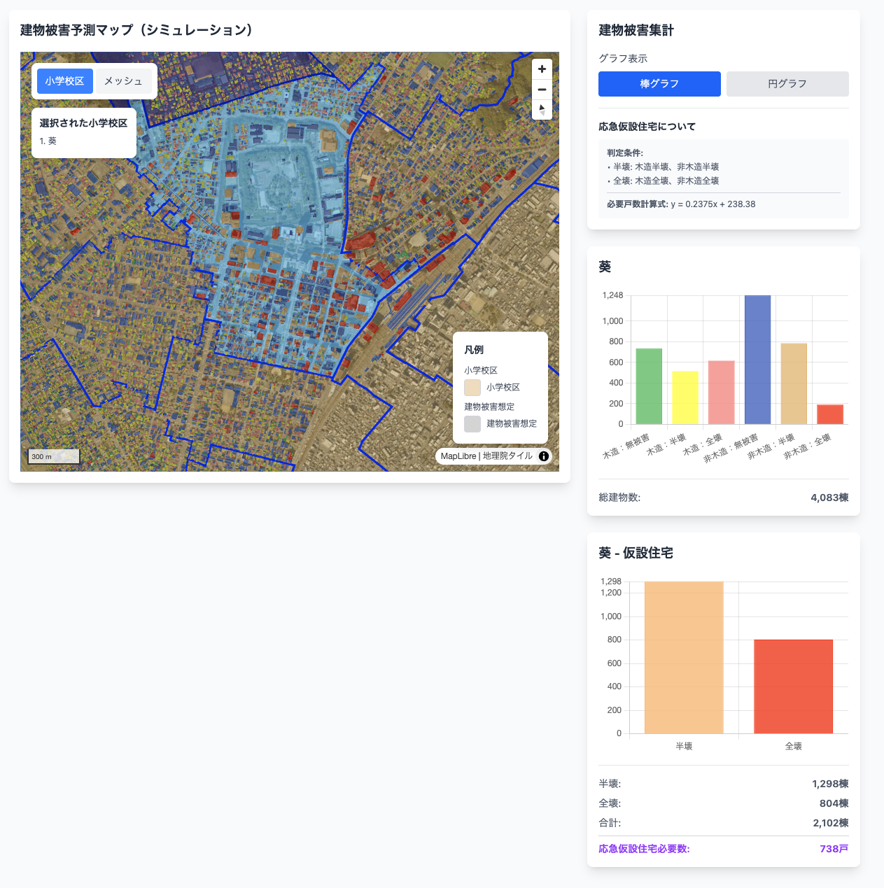
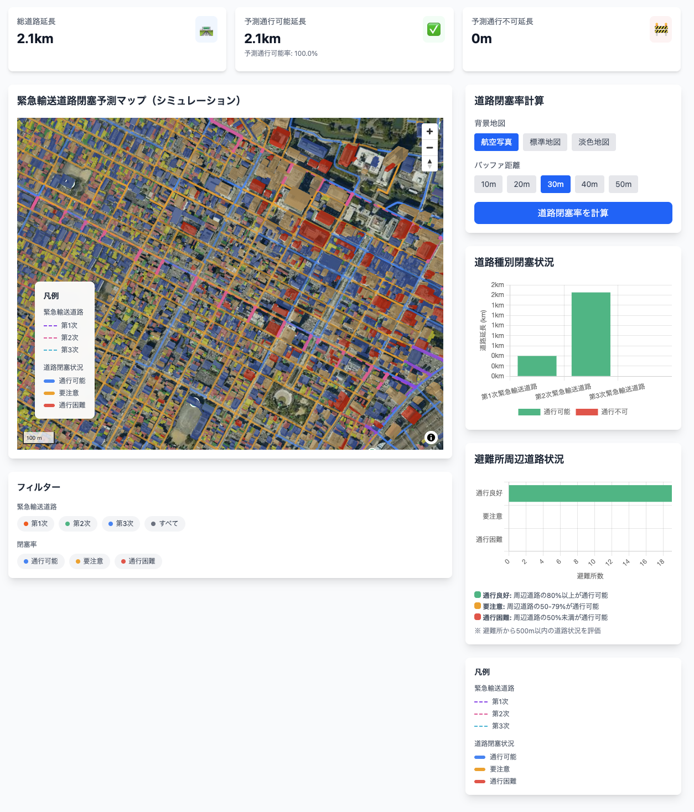
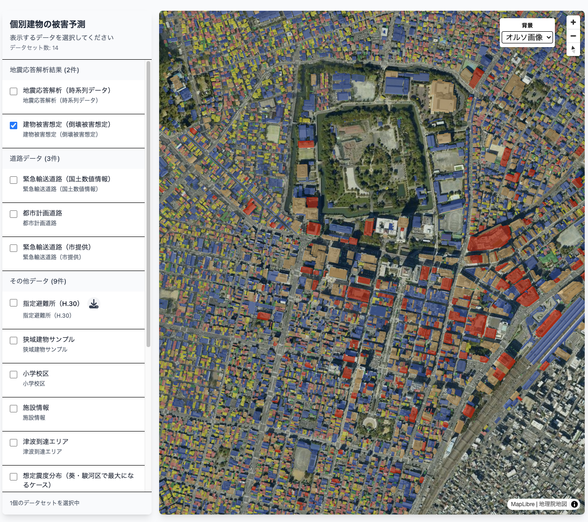

# 操作マニュアル

# 1 本書について

本書では、建物振動シミュレーションシステム（以下「本システム」という。）の操作手順について記載しています。

# 2 使い方

## 2-1 トップ画面

本システムにアクセスすると、トップ画面が表示されます。

「過去のシミュレーション」から保存されたシミュレーション結果を閲覧・分析できます。「新規シミュレーション」から新しいシミュレーションの計算を開始できます。

## 2-2 新規シミュレーション

### 2-2-1 シミュレーションの予約

トップ画面で「新規シミュレーション」をクリックすると、シミュレーション予約画面が表示されます。以下のステップに沿って操作してください。

**ステップ 1: 都道府県・市区町村選択**

シミュレーション対象の都道府県と市区町村を選択してください。

**ステップ 2: 地区選択**

対象となる地区を地図上で選択してください。ドラッグで範囲選択、Shiftキー＋クリックで個別選択/解除が可能です。

**ステップ 3: 地震動パラメータ設定**

地震動プリセットを選択してください。

**ステップ 4: 確認**

入力内容を確認してください。推定実行時間、対象地域、メッシュコード、地震動プリセットが表示されます。内容に問題がなければ「実行する」を押下してください。

シミュレーション実行には時間が掛かります。シミュレーション実行が予約されると過去のシミュレーション一覧に追加されます。

## 2-3 過去のシミュレーション一覧

保存されたシミュレーション結果を検索・閲覧できます。

キーワード、開始日、終了日、ログイン要否でフィルタリングが可能です。

一覧には地域、地震動パラメーター、ステータス、日時などが表示されます。「ダッシュボードを開く」ボタンからシミュレーション結果の可視化画面に遷移できます。

## 2-4 ダッシュボード（シミュレーション結果の閲覧）

### 2-4-1 都市別地震被害シミュレーション

ダッシュボード画面では、シミュレーション結果を以下の3つのタブで確認できます。

- **建物の被害予測（集計）**: 総建物数、予測被害建物数、予測大破・倒壊数、応急仮設住宅必要数の集計を表示します。
- **道路状況の予測（集計）**: 道路閉塞率などの道路被害状況を表示します。
- **個別建物の被害予測**: 個別建物ごとの被害予測を表示します。

建物被害予測マップでは、小学校区またはメッシュ単位で建物被害を集計・表示できます。

### 2-4-2 建物被害の予測（集計）

建物被害の予測タブを選択し、小学校区で対象区域を選択します。

対象区域内の建物被害予測数が表示されます。建物被害状況に応じて、必要と予想される応急仮設住宅必要数が表示されます。

- **建物被害予測マップ**: 地図上で小学校区・メッシュ単位の切り替えが可能です。建物被害想定が色分けで表示されます。
- **建物被害集計**: 棒グラフ・円グラフで木造/非木造別の被害状況（無被害、半壊、全壊）を表示します。
- **仮設住宅**: 半壊・全壊の棟数から応急仮設住宅必要数を算出・表示します。

### 2-4-3 道路閉塞率の分析

「道路状況の予測（集計）」のタブを選択します。

マップ表示範囲内の緊急輸送道路の閉塞状況を予測・表示します。

- **総道路延長・予測通行可能延長・予測通行不可延長**: 道路の被害状況のサマリーが表示されます。
- **緊急輸送道路閉塞予測マップ**: 第1次〜第3次の緊急輸送道路について、通行可能・要注意・通行困難を色分けで表示します。
- **道路閉塞率計算**: 背景地図の切り替え（航空写真・標準地図・淡色地図）やバッファ距離（10m〜50m）を設定して閉塞率を計算できます。
- **道路種別閉塞状況**: 第1次〜第3次緊急輸送道路ごとの通行可能・通行不可の延長をグラフで表示します。
- **フィルター**: 緊急輸送道路の種別や閉塞率で表示内容を絞り込めます。

### 2-4-4 個別建物の被害予測

表示するデータセットを選択し、個別建物の被害予測を地図上で確認できます。

- **地震応答解析結果**: 地震応答解析（時系列データ）、建物被害想定（倒壊被害想定）を表示できます。
- **道路データ**: 緊急輸送道路（国土数値情報）、都市計画道路、緊急輸送道路（市提供）を表示できます。
- **その他データ**: 指定避難所、狭域建物サンプル、小学校区、施設情報、津波到達エリア、想定震度分布などのレイヤーを重ねて表示できます。

背景地図はオルソ画像などから選択可能です。

